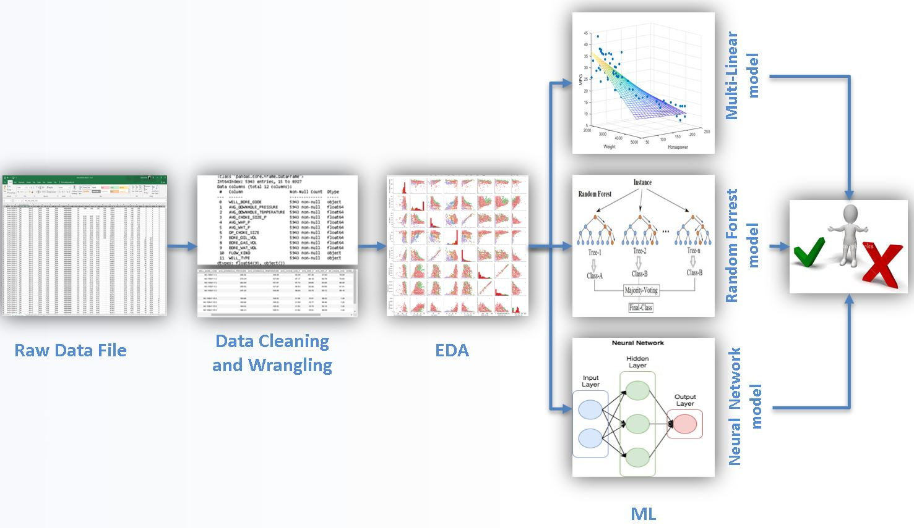
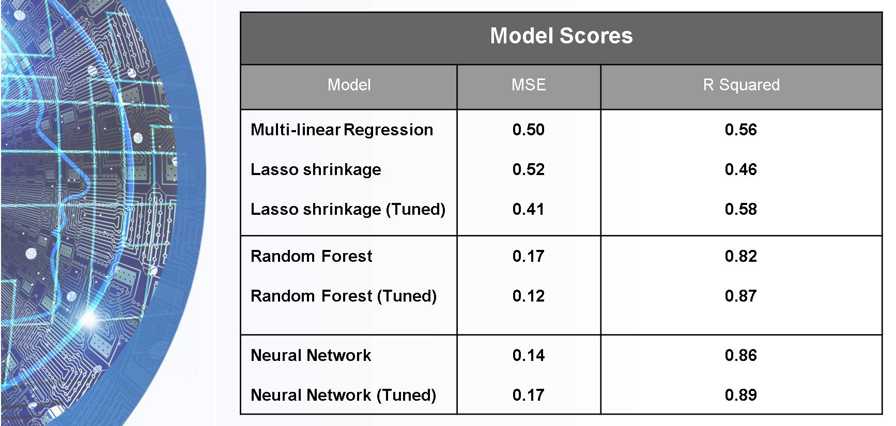

Sruthi Karicheri, Suparna Bhattacharjee(https://github.com/suparnabh), Jennie Ran (https://github.com/jran14)

###### Scope of the Project::point_down:

1.	To build a prediction model to determine the downhole pressure of a test well.
2.	To understand the interdependencies of the different variables in the dataset 

###### Task Breakdown::point_down:

a.	Extraction and Understanding of the production and subsurface dataset. 
    
    Analyze the various production parameters from each well and establish correlations and variances.

b.	Transforming the dataset
:notebook_with_decorative_cover: NOTEBOOK - data_etl.ipynb

    – Performing some data wrangling and clean up
    - exploratory data analysis   
    
    
c.	Design training and testing parameters/wells.
 
 :notebook_with_decorative_cover: NOTEBOOK - data_etl.ipynb

    - linear regression 
    - Basic Linear model with Lasso shrinkage
    - random forest regression model  
    
    
 :notebook_with_decorative_cover: NOTEBOOK - Final Notebooks_Hyppertuning and Plots/grid_randomized_searchcv.ipynb
 
        -Gridsearch CV
        -Tune Lasso Model
        -Tune Randomforest Model 
     
     
  :notebook_with_decorative_cover: NOTEBOOK - NeuralAnalysis.ipynb
  
        -Neural Network Model
        -Hyperas tuning of NN
        
  :notebook_with_decorative_cover: NOTEBOOK individual well analysis 
  
        - EDA_individualwells.ipynb (for future analysis)
        
   # Final Report :- Project 3 Report.docx
   # Presentation slide :- ml_presentation.pptx 
   # Our Website [Machine Learning of the Equinor Volve Field Production Data](https://sgk2004.github.io/Volve-Dataset/)

